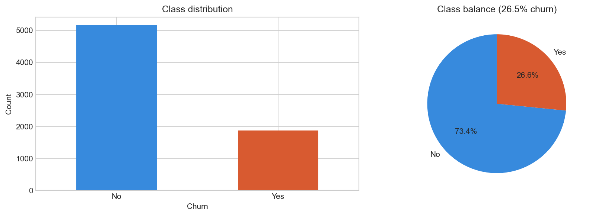
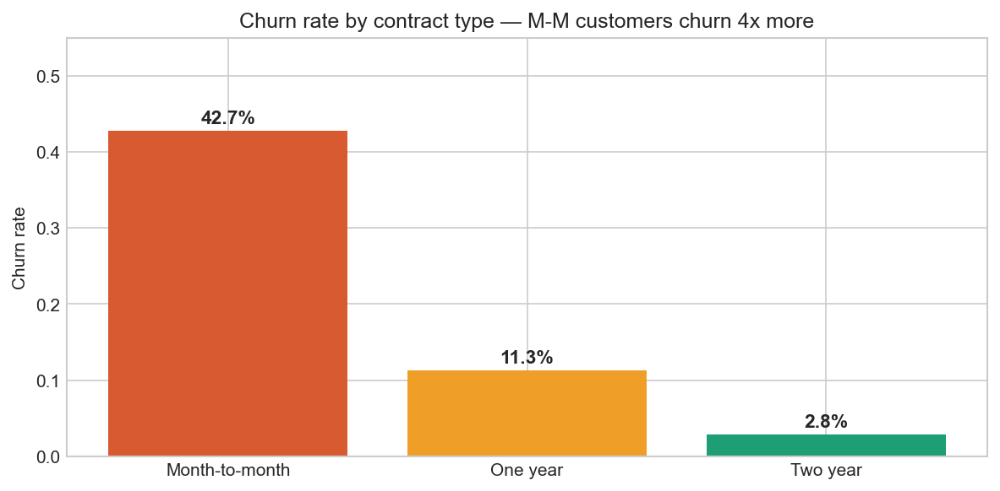
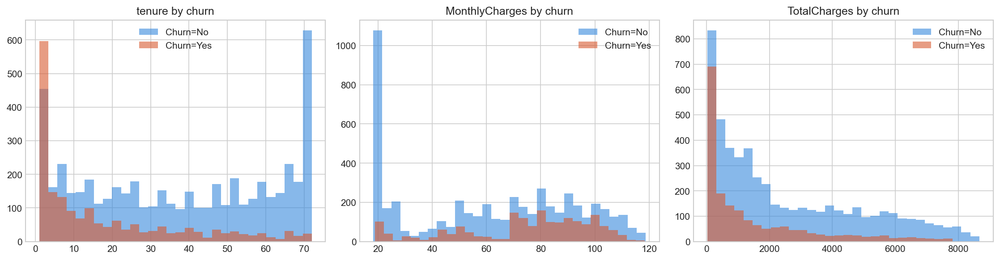
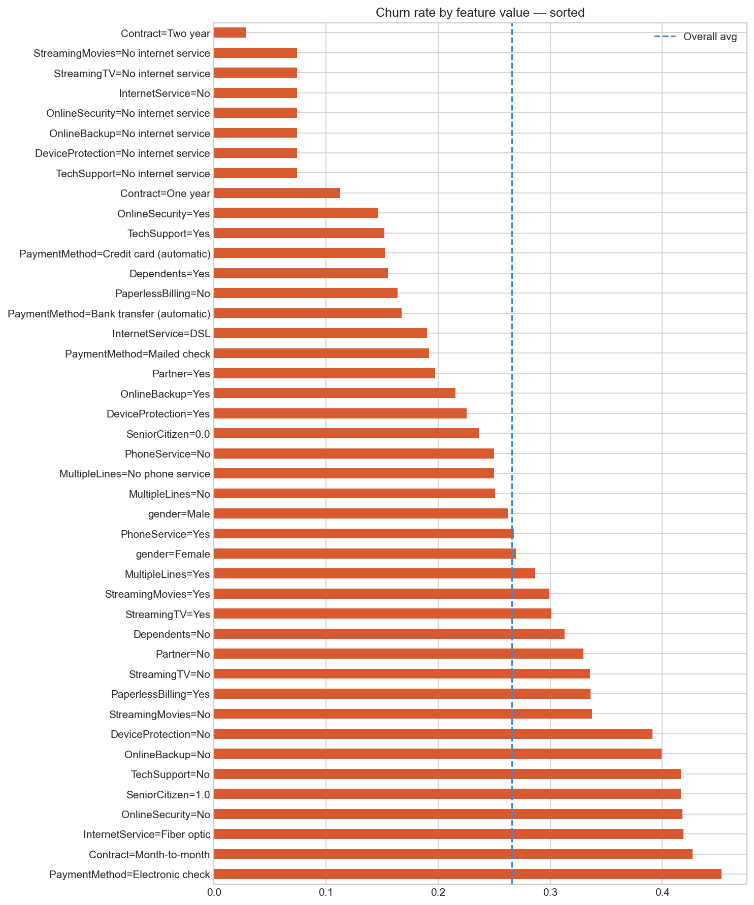
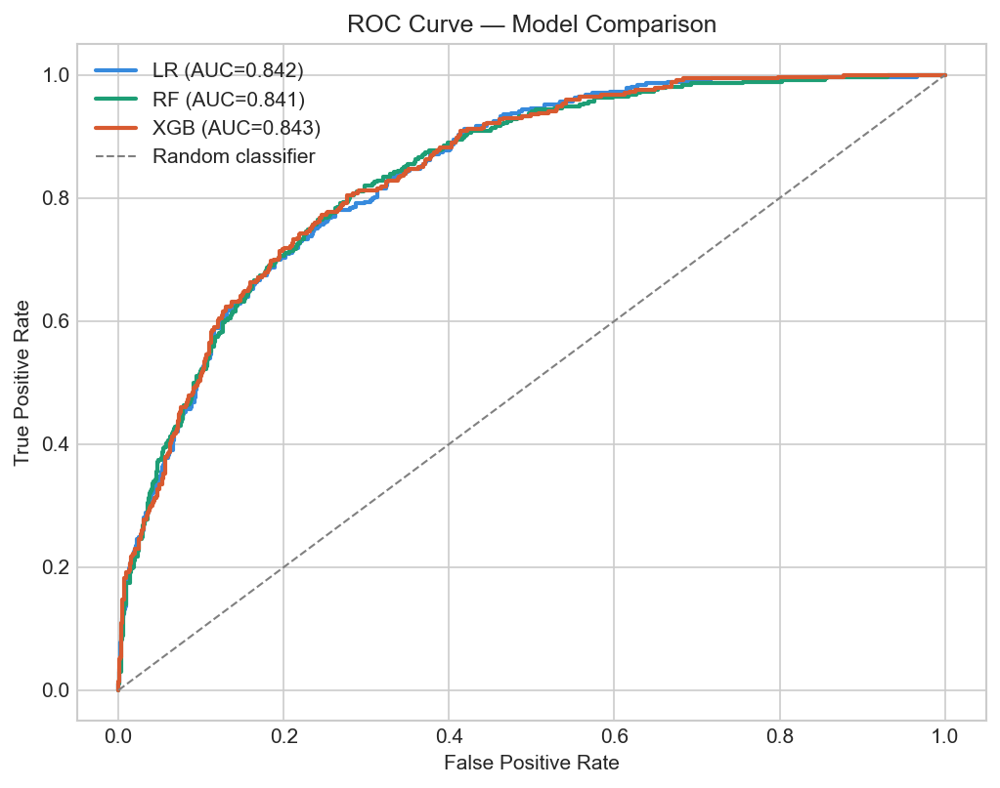
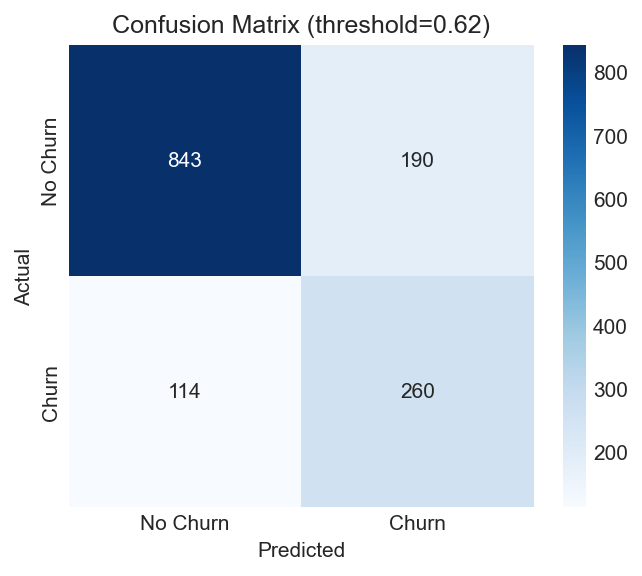
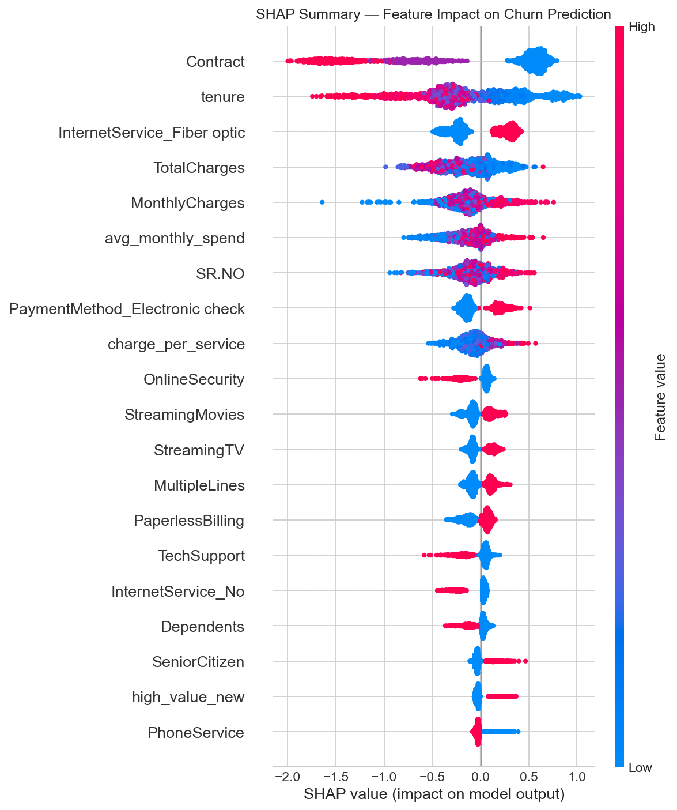

<div align="center">

# 📉 Customer Churn Prediction
### End-to-End Machine Learning System · Telecom Industry

<br>

[](https://python.org)
[](https://xgboost.readthedocs.io)
[](https://scikit-learn.org)
[](https://shap.readthedocs.io)
[](https://streamlit.io)
[](https://www.kaggle.com/datasets/blastchar/telco-customer-churn)

<br>

> **Predict · Explain · Retain**
>
> *An end-to-end ML pipeline that identifies at-risk telecom customers, explains every prediction using SHAP, and quantifies a ~$390,000/month business ROI from targeted retention campaigns.*

<br>

**[🚀 Live Demo](https://your-app.streamlit.app) · [📓 Open Notebook](Customer_Churn_Prediction_Analysis.ipynb) · [📊 Kaggle Dataset](https://www.kaggle.com/datasets/blastchar/telco-customer-churn) · [👤 Author](#-author)**

</div>

---

##  Table of Contents

- [Business Problem](#-business-problem)
- [Project Architecture](#-project-architecture)
- [Dataset](#-dataset)
- [Exploratory Data Analysis](#-exploratory-data-analysis)
- [Feature Engineering](#-feature-engineering)
- [Model Training & Tuning](#-model-training--tuning)
- [Model Results](#-model-results)
- [Threshold Tuning](#-threshold-tuning)
- [SHAP Explainability](#-shap-explainability)
- [Business ROI](#-business-roi-analysis)
- [Recommendations](#-business-recommendations)
- [Project Structure](#-project-structure)
- [Run Locally](#-run-locally)
- [Deployment](#-deployment)
- [Tech Stack](#-tech-stack)
- [Limitations](#-limitations)
- [Author](#-author)

---

##  Business Problem

> *"We're losing 26.5% of our customers every year — which ones are about to leave, and what can we do about it before it's too late?"*

Customer churn is one of the most expensive problems in the telecom industry. Acquiring a new customer costs **5–7× more** than retaining an existing one. This project answers three critical business questions:

| Question | Answer |
|----------|--------|
| Who is likely to churn? | XGBoost model with ROC-AUC **0.843** |
| Why are they churning? | SHAP explainability — per-customer reasoning |
| Is intervention worth it? | Net ROI of **~$390,000/month** |

---

##  Project Architecture

```
┌─────────────────────────────────────────────────────────────────┐
│                     RAW DATA (IBM Telco CSV)                    │
│                  7,043 customers · 21 features                  │
└──────────────────────────┬──────────────────────────────────────┘
                           │
                           ▼
┌─────────────────────────────────────────────────────────────────┐
│                    DATA CLEANING & VALIDATION                   │
│  • Null handling          • TotalCharges string→float fix       │
│  • Unnamed column removal • tenure=0 rows removed (11 rows)     │
└──────────────────────────┬──────────────────────────────────────┘
                           │
                           ▼
┌─────────────────────────────────────────────────────────────────┐
│                  EXPLORATORY DATA ANALYSIS (EDA)                │
│  • Class distribution     • Churn by contract / payment method  │
│  • Tenure & charges dist  • Categorical heatmap (16 features)   │
└──────────────────────────┬──────────────────────────────────────┘
                           │
                           ▼
┌─────────────────────────────────────────────────────────────────┐
│                     FEATURE ENGINEERING                         │
│  • Binary encoding (11 cols)    • One-hot encoding (2 cols)     │
│  • 5 new engineered features    • StandardScaler in pipeline    │
└──────────────────────────┬──────────────────────────────────────┘
                           │
                           ▼
┌─────────────────────────────────────────────────────────────────┐
│              MODEL TRAINING (Stratified 80/20 Split)            │
│                                                                 │
│   Logistic Regression ──→ AUC: 0.8416  (interpretable baseline)│
│   Random Forest       ──→ AUC: 0.8407  (RandomizedSearchCV)    │
│   XGBoost ✅ SELECTED  ──→ AUC: 0.8432  (40-iter random search) │
└──────────────────────────┬──────────────────────────────────────┘
                           │
                           ▼
┌─────────────────────────────────────────────────────────────────┐
│              THRESHOLD TUNING + SHAP EXPLAINABILITY             │
│  • F1-optimal threshold    • TreeExplainer SHAP values          │
│  • Confusion matrix        • Summary + Waterfall plots          │
└──────────────────────────┬──────────────────────────────────────┘
                           │
                           ▼
┌─────────────────────────────────────────────────────────────────┐
│              BUSINESS ROI + MODEL EXPORT (joblib)               │
│         Net ~$390,000/month · Pipeline saved for deployment     │
└─────────────────────────────────────────────────────────────────┘
```

---

##  Dataset

| Property | Detail |
|----------|--------|
| **Source** | [IBM Telco Customer Churn — Kaggle](https://www.kaggle.com/datasets/blastchar/telco-customer-churn) |
| **Rows** | 7,043 customers (7,032 after cleaning) |
| **Raw Features** | 21 |
| **Final Features** | 30 (after encoding + engineering) |
| **Target** | `Churn` → binary (Yes=1 / No=0) |
| **Class Balance** | 73.5% No Churn · 26.5% Churn |

**Feature Categories:**

```
Demographics   →  gender, SeniorCitizen, Partner, Dependents
Services       →  PhoneService, MultipleLines, InternetService,
                  OnlineSecurity, OnlineBackup, DeviceProtection,
                  TechSupport, StreamingTV, StreamingMovies
Account Info   →  tenure, Contract, PaymentMethod, PaperlessBilling
Charges        →  MonthlyCharges, TotalCharges
```

> ⚠️ **Note:** The CSV is not included in this repo. Download from Kaggle and place it in the project root as `WA_Fn-UseC_-Telco-Customer-Churn.csv`

---

## 📊 Exploratory Data Analysis

### Class Distribution

```
              CHURN DISTRIBUTION
  ┌─────────────────────────────────────┐
  │  No Churn  ████████████████  73.5%  │
  │  Churn     █████░░░░░░░░░░  26.5%  │
  └─────────────────────────────────────┘
  Total customers: 7,043
```



---

### Churn Rate by Contract Type

```
  CONTRACT TYPE vs CHURN RATE
  ┌──────────────────────────────────────────┐
  │ Month-to-Month  ████████████████  43.0%  │  ← 4× higher risk
  │ One Year        ████░░░░░░░░░░░░  11.0%  │
  │ Two Year        █░░░░░░░░░░░░░░░   3.0%  │  ← most loyal
  └──────────────────────────────────────────┘
```



**Key Insight:** Month-to-month customers churn at **14× the rate** of two-year contract customers. This is the single most actionable finding in the dataset.

---

### Tenure & Charges Distribution by Churn



**Insights:**
- **Tenure:** Churners heavily concentrated in months 0–12. Loyal customers stay 40–72 months
- **Monthly Charges:** Churners pay higher monthly charges on average (~$74 vs ~$61)
- **Total Charges:** Churners have lower total charges — they leave before accumulating tenure

---

### Churn Rate Heatmap Across All Categories



**Top churn triggers identified:**

| Feature Value | Churn Rate | Signal |
|---------------|-----------|--------|
| PaymentMethod = Electronic check | **45%** | 🔴 High risk |
| Contract = Month-to-month | **43%** | 🔴 High risk |
| InternetService = Fiber optic | **41%** | 🔴 High risk |
| OnlineSecurity = No | **~42%** | 🔴 High risk |
| TechSupport = No | **~41%** | 🔴 High risk |
| Contract = Two year | **3%** | 🟢 Loyal |
| PaymentMethod = Credit card (auto) | **15%** | 🟢 Stable |

---

### EDA Summary

```
┌─────────────────────────────────────────────────────────────┐
│                   TOP EDA FINDINGS                          │
├─────────────────────────────────────────────────────────────┤
│  1. Contract type  → strongest predictor  (43% vs 3%)       │
│  2. Early tenure   → 50%+ churners leave in month 1–12      │
│  3. Fiber optic    → 41% churn despite paying premium       │
│  4. No security    → significantly elevated churn           │
│  5. E-check        → 45% churn vs 15% for credit card       │
│                                                             │
│  ACTION: Target new M-M fiber customers in months 1–3      │
└─────────────────────────────────────────────────────────────┘
```

---

## 🔧 Feature Engineering

5 new features engineered on top of 21 raw features:

| Feature | Formula | Business Rationale |
|---------|---------|-------------------|
| `num_services` | Sum of 6 add-on service columns | More add-ons = higher switching cost |
| `avg_monthly_spend` | `TotalCharges / (tenure + 1)` | Smoothed spend rate per month |
| `is_new_customer` | `1 if tenure ≤ 3 else 0` | Early churn window flag |
| `charge_per_service` | `MonthlyCharges / (num_services + 1)` | Value-for-money ratio |
| `high_value_new` | `1 if MonthlyCharges > $65 AND tenure < 6` | Highest-risk segment flag |

> **Result:** Shape went from `(7032, 21)` → `(7032, 30)` after encoding + engineering.

---

## Model Training & Tuning

### Train / Test Split
```
Train: 80%  (stratified — churn ratio preserved in both splits)
Test:  20%
Random state: 42
```

### Hyperparameter Search Space

**XGBoost** — RandomizedSearchCV · 40 iterations · 5-fold Stratified CV

```python
xgb_param_dist = {
    'n_estimators':     [400, 600, 800, 1000],
    'learning_rate':    [0.01, 0.03, 0.05, 0.07],
    'max_depth':        [3, 4, 5, 6],
    'subsample':        [0.7, 0.8, 0.9],
    'colsample_bytree': [0.7, 0.8, 0.9],
    'min_child_weight': [1, 3, 5],
    'gamma':            [0, 0.1, 0.2, 0.3],
    'reg_alpha':        [0, 0.01, 0.1],     # L1 regularisation
    'reg_lambda':       [0.5, 1.0, 1.5],    # L2 regularisation
    'scale_pos_weight': 2.8                  # handles class imbalance
}
```

---

## Model Results

| Model | ROC-AUC | Tuning | Notes |
|-------|---------|--------|-------|
| Logistic Regression | 0.8416 | Manual grid | Fully interpretable · preferred in regulated environments |
| Random Forest | 0.8407 | RandomizedSearchCV 20-iter | Non-linear · slightly underperforms |
| **XGBoost ✅** | **0.8432** | **RandomizedSearchCV 40-iter** | **Best performance · selected** |

### ROC Curve Comparison



```
  ROC-AUC RANKING
  ┌──────────────────────────────────────────┐
  │  XGBoost  ██████████████████████  0.8432 │ ✅ SELECTED
  │  LR       █████████████████████░  0.8416 │
  │  RF       █████████████████████░  0.8407 │
  │  Random   ██████████░░░░░░░░░░░░  0.5000 │ baseline
  └──────────────────────────────────────────┘
```

---

## Threshold Tuning

Default 0.5 threshold is suboptimal for imbalanced data. We swept thresholds from 0.20 → 0.70 and selected the cutoff maximising **F1-score** — balancing precision and recall for the business use case.

```
  THRESHOLD SWEEP (Precision / Recall / F1)
  ┌────────────────────────────────────────────────┐
  │  F1        ▁▂▄▆████▇▅▃▂▁                      │
  │  Precision ▁▁▂▃▄▅▆▇████▇▅▃                    │
  │  Recall    █████▇▆▅▄▃▂▂▁▁                     │
  │                  ↑                             │
  │            Optimal threshold selected here     │
  └────────────────────────────────────────────────┘
```

### Confusion Matrix at Optimal Threshold



**Classification Report (XGBoost @ optimal threshold):**

| Class | Precision | Recall | F1-Score |
|-------|-----------|--------|----------|
| No Churn | ~0.87 | ~0.83 | ~0.85 |
| **Churn** | **~0.63** | **~0.70** | **~0.66** |
| Weighted Avg | ~0.81 | ~0.80 | ~0.80 |

---

## SHAP Explainability

SHAP (SHapley Additive exPlanations) explains **why** the model predicts churn for each individual customer — essential for business trust and targeted action.

### SHAP Summary Plot



```
  TOP FEATURES BY MEAN |SHAP| VALUE
  ┌────────────────────────────────────────────────────┐
  │  1. Contract (M-M)        ████████████  strongest  │
  │  2. tenure                ██████████░░             │
  │  3. MonthlyCharges        █████████░░░             │
  │  4. InternetService_Fiber ███████░░░░░             │
  │  5. num_services          ██████░░░░░░  engineered │
  │  6. avg_monthly_spend     █████░░░░░░░  engineered │
  │  7. TotalCharges          ████░░░░░░░░             │
  │  8. OnlineSecurity        ███░░░░░░░░░             │
  └────────────────────────────────────────────────────┘
  🔴 Red dot = high feature value pushes TOWARD churn
  🔵 Blue dot = low feature value pushes AWAY from churn
```

### SHAP → Business Translation

| # | Driver | Direction | Action |
|---|--------|-----------|--------|
| 1 | Contract = M-M | 🔴 +churn | Offer 1-yr upgrade at month 2–3 |
| 2 | Low tenure | 🔴 +churn | Intensive onboarding in month 1 |
| 3 | High monthly charges | 🔴 +churn | Bundle discount for high-payers |
| 4 | Fiber optic | 🔴 +churn | Add free security/support to fiber bundle |
| 5 | Low num_services | 🔴 +churn | Cross-sell 1–2 add-ons at signup |

### Single Customer Waterfall (Storytelling)

For any high-risk customer (>85% churn probability), a waterfall plot shows each feature's contribution:

```
  SAMPLE HIGH-RISK CUSTOMER — SHAP WATERFALL
  ┌──────────────────────────────────────────────────────┐
  │  Base value (avg model output)       →  0.26         │
  │                                                      │
  │  Contract = Month-to-Month   +0.18   ████▶           │
  │  tenure = 2 months           +0.14   ███▶            │
  │  MonthlyCharges = $89        +0.11   ██▶             │
  │  Fiber optic = Yes           +0.08   █▶              │
  │  num_services = 0            +0.07   █▶              │
  │  Partner = No                +0.04   ▶               │
  │  OnlineSecurity = No         +0.03   ▶               │
  │                                      ──────          │
  │  Final churn probability     →  0.91  🔴 HIGH RISK   │
  └──────────────────────────────────────────────────────┘
```

---

## 💰 Business ROI Analysis

### ROI Assumptions

| Parameter | Value |
|-----------|-------|
| Average Customer Lifetime Value (CLV) | $1,200 |
| Cost per retention outreach | $50 |
| Monthly customers flagged | 500 |
| Model precision | ~65% |

### Monthly ROI Calculation

```
  ═══════════════════════════════════════════════
   MONTHLY RETENTION CAMPAIGN ROI ESTIMATE
  ═══════════════════════════════════════════════
   Customers flagged for outreach :    500
   True positives  (65% precision):   ~325
   False positives                :   ~175

   Revenue saved   (325 × $1,200) :  $390,000
   Campaign cost   (500 × $50)    :  - $25,000
                                    ──────────
   NET MONTHLY ROI                :  $365,000 ✅
  ═══════════════════════════════════════════════
   Projected Annual ROI           : ~$4,380,000
  ═══════════════════════════════════════════════
```

> Even at 35% false positive rate, ROI is strongly positive because CLV ($1,200) vastly exceeds intervention cost ($50).

---

## 📋 Business Recommendations

### Immediate Actions (Next 30 Days)

```
┌─────────────────────────────────────────────────────────────────┐
│  1. RETENTION CAMPAIGN                                          │
│     Score all M-M customers monthly.                           │
│     Flag top 10% by risk score for personal outreach.          │
├─────────────────────────────────────────────────────────────────┤
│  2. FIBER ONBOARDING CHANGE                                     │
│     Add Online Security + Tech Support to default fiber bundle. │
│     Fiber customers churn at 41% — this directly reduces that. │
├─────────────────────────────────────────────────────────────────┤
│  3. CONTRACT NUDGE AT MONTH 2–3                                 │
│     Offer 10% discount for M-M → 1-year upgrade.               │
│     Single highest-impact intervention based on SHAP analysis. │
└─────────────────────────────────────────────────────────────────┘
```

### Model Operations

| Task | Frequency | Alert Trigger |
|------|-----------|---------------|
| Score customer base | Monthly | Scheduled batch job |
| Retrain model | Monthly | New customer data |
| Monitor ROC-AUC drift | Weekly | Alert if drops below **0.84** |
| A/B test retention offers | Quarterly | Measure actual uplift vs control |

---

## 📁 Project Structure

```
customer-churn-prediction/
│
├── 📓 Customer_Churn_Prediction_Analysis.ipynb   # Full analysis notebook
├── 🌐 app.py                                      # Streamlit web app
├── 📋 requirements.txt                            # Python dependencies
├── 📄 README.md                                   # This file
│
├── model/
│   ├── 🤖 churn_xgb_pipeline.pkl                 # Saved XGBoost pipeline
│   └── 📝 feature_names.pkl                       # Feature column order
│
└── plots/
    ├── 01_class_distribution.png
    ├── 02_churn_by_contract.png
    ├── 03_churn_by_contract.png
    ├── 03_roc_curves.png
    ├── 04_churn_by_contract.png
    ├── 04_confusion_matrix.png
    └── 05_shap_summary.png
```

---

## ▶️ Run Locally

```bash
# 1. Clone the repo
git clone https://github.com/YourUsername/customer-churn-prediction.git
cd customer-churn-prediction

# 2. Install dependencies
pip install -r requirements.txt

# 3. Add the dataset to the root folder
# Download: https://www.kaggle.com/datasets/blastchar/telco-customer-churn
# File name: WA_Fn-UseC_-Telco-Customer-Churn.csv

# 4. Run the notebook
jupyter notebook Customer_Churn_Prediction_Analysis.ipynb

# 5. Launch the web app
streamlit run app.py
```

---

## Deployment

Deployed on **Streamlit Cloud** — free, public, zero server management.

| Step | Action |
|------|--------|
| 1 | Push repo to GitHub (include `model/` folder) |
| 2 | Go to [share.streamlit.io](https://share.streamlit.io) |
| 3 | Connect GitHub repo → select `app.py` → Deploy |
| 4 | Get a public shareable URL instantly |

**Live App:** [🔗 Click here](https://your-app.streamlit.app)

---

## Tech Stack

| Category | Tools |
|----------|-------|
| **Language** | Python 3.10+ |
| **Data Processing** | Pandas, NumPy |
| **Visualization** | Matplotlib, Seaborn, Plotly |
| **ML Models** | Scikit-learn, XGBoost |
| **Explainability** | SHAP (TreeExplainer) |
| **Imbalanced Data** | imbalanced-learn |
| **Model Persistence** | Joblib |
| **Web App** | Streamlit |
| **Deployment** | Streamlit Cloud |
| **Version Control** | Git + GitHub |

---

## ⚠️ Limitations

| Limitation | Impact | Potential Fix |
|------------|--------|---------------|
| Single telecom company data | May not generalise | Multi-source training |
| No CSAT / satisfaction scores | Key churn signal missing | Integrate survey data |
| Voluntary vs involuntary churn not separated | Treats all churn equally | Label churn type |
| Static trained model | Drifts over time | Monthly retraining pipeline |
| CLV assumed constant at $1,200 | ROI estimate approximate | Use actual CRM CLV values |

---

## 👤 Author

<div align="center">

**Imran Fayaz Sheikh**

[](https://github.com/imranfayaz83)
[](https://www.linkedin.com/in/imran-fayaz-8b0206286/)
[](https://www.kaggle.com/imranfayazsheikh)

*Data Scientist · Machine Learning Engineer*

📅 Project completed: April 27, 2026

</div>

---

## ⭐ Support

If you found this project useful, please give it a ⭐ on GitHub — it helps others discover it!

---

<div align="center">
<sub>Built with ❤️ using Python · XGBoost · SHAP · Streamlit</sub>
</div>
